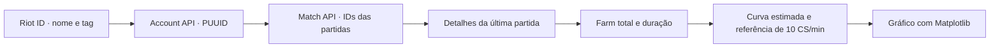

# LolGraphs

**Aprendendo Python e Matplotlib com estatísticas de League of Legends.**

O LolGraphs foi criado para praticar programação em Python, consumo de APIs e visualização de dados. A ideia é transformar estatísticas obtidas pela **API da Riot Games** em gráficos que ajudem a observar o desempenho de um jogador.

O principal experimento é a análise de **farm (CS)**: consultar a última partida, calcular a quantidade de minions abatidos e comparar o resultado com uma referência de 10 CS por minuto. O repositório também reúne exemplos de gráficos com dados fictícios e exercícios de probabilidade usados durante o aprendizado.

> Projeto de estudo em evolução. Há duas versões do script de integração com a Riot, com diferenças importantes descritas em [Estado atual](#estado-atual).

## Sumário

- [Objetivo e aprendizados](#objetivo-e-aprendizados)
- [O que o projeto explora](#o-que-o-projeto-explora)
- [Tecnologias](#tecnologias)
- [Estrutura do repositório](#estrutura-do-repositório)
- [Instalação](#instalação)
- [Configuração da API da Riot](#configuração-da-api-da-riot)
- [Como executar](#como-executar)
- [Como os dados viram gráficos](#como-os-dados-viram-gráficos)
- [Estado atual](#estado-atual)
- [Solução de problemas](#solução-de-problemas)
- [Próximos passos possíveis](#próximos-passos-possíveis)
- [Autoria e licença](#autoria-e-licença)

## Objetivo e aprendizados

O projeto usa um tema próximo do dia a dia de quem joga LoL para exercitar:

- Funções, listas, dicionários, laços e entrada de dados.
- Requisições HTTP com `requests`.
- Leitura e navegação de respostas JSON.
- Identificação de jogadores por Riot ID e PUUID.
- Consulta de partidas e extração de estatísticas.
- Cálculo de médias, proporções e valores acumulados.
- Gráficos de linhas e barras com Matplotlib.
- Personalização de eixos, títulos, legendas, cores e grades.
- Combinatória e distribuição de probabilidades em exercícios com dados.

## O que o projeto explora

| Experimento | Origem dos dados | Arquivo |
| --- | --- | --- |
| Consulta de perfil e partidas | API da Riot | [graph/userGet.py](graph/userGet.py) |
| Farm da última partida e comparação com uma meta | API da Riot, com curva estimada a partir do total | [graph/userGet.py](graph/userGet.py) |
| Evolução do farm pela timeline | API da Riot; versão com erro de sintaxe a corrigir | [userGet.py](userGet.py) |
| Gráficos de farm e abates | Listas de exemplo definidas no código | [lolGraph.py](lolGraph.py) |
| Probabilidade das somas de dados | Combinações calculadas em Python | [graph.py](graph.py) |
| Exercício de leitura de JSON | Dicionário local de exemplo | [jsonPyTest.py](jsonPyTest.py) |
| Exercício de requisição HTTP | API pública do GitHub | [requestsTest.py](requestsTest.py) |

A referência de **10 CS/min** e as linhas apresentadas como médias de elo nos exemplos são valores definidos para o exercício. Não são médias oficiais calculadas pela API da Riot.

## Tecnologias

- **Python** — lógica, tratamento dos dados e execução dos scripts.
- **Matplotlib** — criação e exibição dos gráficos.
- **Requests** — comunicação HTTP com as APIs.
- **Riot Games API** — dados de contas e partidas.
- **itertools e statistics** — combinatória e cálculos nos exercícios de probabilidade.

O [requirements.txt](requirements.txt) também contém ferramentas de Jupyter e outras dependências do ambiente de desenvolvimento. Os scripts principais utilizam diretamente Matplotlib e Requests.

## Estrutura do repositório

```text
LolGraphs/
├── README.md
├── requirements.txt
├── userGet.py          # Experimento com a timeline da última partida
├── lolGraph.py         # Gráficos de LoL com dados de exemplo
├── graph.py            # Funções de gráficos de probabilidade
├── input.py            # Entrada para um dado
├── input2.py           # Entrada para dois dados
├── inputDiceRoll.py     # Entrada para quantidade variável de dados
├── jsonPyTest.py        # Exercício com dicionários/JSON
├── requestsTest.py      # Exercício de requisição HTTP
├── rangetest.py         # Exercício com range
├── graph/
│   ├── userGet.py       # Versão que estima a curva pelo farm total
│   └── ...             # Outras versões dos exercícios
└── __pycache__/         # Arquivos compilados pelo Python
```

Os arquivos da raiz e da pasta `graph/` não são todos idênticos. Os comandos deste README indicam explicitamente qual versão executar.

## Instalação

### Requisitos

- **Python 3.10 ou superior** para os scripts, incluindo os exercícios que usam `match/case`.
- Acesso à internet e uma chave válida da Riot para as consultas de partidas.
- Ambiente gráfico local para abrir as janelas do Matplotlib.

### Clonar o projeto

```bash
git clone https://github.com/RainanKaneka/LolGraphs.git
cd LolGraphs
```

### Criar um ambiente virtual

**Windows — PowerShell:**

```powershell
py -3 -m venv venv
.\venv\Scripts\Activate.ps1
```

**Linux/macOS:**

```bash
python3 -m venv venv
source venv/bin/activate
```

### Instalar as bibliotecas dos scripts

As versões abaixo correspondem às bibliotecas diretas registradas no repositório:

```bash
python -m pip install matplotlib==3.10.8 requests==2.32.5
```

Para reproduzir a lista completa do ambiente original, existe o comando:

```bash
python -m pip install -r requirements.txt
```

Essa lista inclui dependências adicionais de Jupyter, versões que podem exigir um Python mais recente e `pywinpty`, específico de Windows. Para executar os exemplos apresentados aqui, a instalação das duas bibliotecas diretas é suficiente.

## Configuração da API da Riot

1. Acesse o [Riot Developer Portal](https://developer.riotgames.com/).
2. Entre com sua conta Riot e obtenha uma chave de desenvolvimento.
3. Configure a chave e o Riot ID no script que será executado.

As chaves de desenvolvimento são desativadas a cada **24 horas** e precisam ser renovadas no portal. Consulte a [documentação de chaves da Riot](https://developer.riotgames.com/docs/portal#api-keys).

### Configuração da versão em graph/userGet.py

Localize e ajuste os valores em [graph/userGet.py](graph/userGet.py):

```python
MINHA_CHAVE = "SUA_CHAVE_DE_DESENVOLVIMENTO"
API_KEY = MINHA_CHAVE

NOME = "SeuGameName"
TAG = "SuaTag"
```

O Riot ID `SeuGameName#SuaTag` é separado em nome e tag; a tag deve ser informada **sem o caractere `#`**.

Esse arquivo também executa consultas de exemplo antes da função principal. Para que elas usem sua conta, ajuste `MEU_NOME`, `MINHA_TAG` e `MEU_PUUID`. Outra opção é comentar as chamadas avulsas de `buscar_perfil_lol(...)` e `buscar_lista_partidas(...)`, mantendo a chamada final de `script_completo_lol()`.

A função principal obtém o PUUID automaticamente a partir de `NOME` e `TAG`.

### Chave fora do código

Os scripts atuais contêm chaves fixas. Gere sua própria chave e mantenha suas credenciais fora dos commits.

Para ler a chave por variável de ambiente, adapte localmente as atribuições no script:

```python
import os

MINHA_CHAVE = os.environ["RIOT_API_KEY"]
API_KEY = MINHA_CHAVE
```

**PowerShell:**

```powershell
$env:RIOT_API_KEY = "SUA_CHAVE_DE_DESENVOLVIMENTO"
python graph/userGet.py
```

**Bash:**

```bash
export RIOT_API_KEY="SUA_CHAVE_DE_DESENVOLVIMENTO"
python graph/userGet.py
```

A leitura dessa variável é uma adaptação sugerida; ainda não está implementada nos arquivos do repositório.

## Como executar

### Farm da última partida com dados da Riot

Depois de configurar a versão da pasta `graph/`:

```bash
python graph/userGet.py
```

O script consulta o perfil, obtém a última partida e extrai o farm total e a duração. Em seguida, abre um gráfico que compara:

- Uma linha de referência de **10 CS por minuto**.
- Uma curva linear estimada usando o total de farm da partida.

**A curva dessa versão é uma estimativa:** o total vem da API, mas sua distribuição ao longo do tempo é calculada por interpolação linear. Ela não mostra o farm realmente registrado em cada minuto.

### Gráfico de abates com dados de exemplo

```bash
python lolGraph.py
```

A chamada ativa nesse arquivo é `graphLolKill()`, que exibe um gráfico de abates acumulados com listas locais. Esse exemplo não exige chave Riot.

A função `graphLolFarm()` também existe, mas precisa alinhar o tamanho da lista de minutos ao tamanho de `farm_real` antes de ser utilizada.

### Outros exercícios

```bash
python jsonPyTest.py
python requestsTest.py
python input.py
python input2.py
python inputDiceRoll.py
```

Os três últimos comandos solicitam a quantidade de lados e/ou dados no terminal e exibem gráficos de probabilidade. Utilize inteiros positivos e quantidades pequenas: o exercício com vários dados enumera todas as combinações possíveis.

Os gráficos são exibidos com `plt.show()`; os scripts não exportam imagens automaticamente.

## Como os dados viram gráficos



As consultas implementadas usam o host `americas.api.riotgames.com` e enviam a chave no cabeçalho `X-Riot-Token`.

| Consulta no código | Rota |
| --- | --- |
| Conta pelo Riot ID | `/riot/account/v1/accounts/by-riot-id/{game_name}/{tag_line}` |
| Partidas pelo PUUID | `/lol/match/v5/matches/by-puuid/{puuid}/ids` |
| Detalhes da partida | `/lol/match/v5/matches/{match_id}` |
| Timeline, na versão da raiz | `/lol/match/v5/matches/{match_id}/timeline` |

O cálculo utilizado nos detalhes da partida é:

```text
Farm total = totalMinionsKilled + neutralMinionsKilled
Duração em minutos = gameDuration / 60
CS por minuto = farm total / duração em minutos
```

Na versão de timeline, a proposta é somar `minionsKilled` e `jungleMinionsKilled` dos frames do participante. Esse caminho ainda precisa do ajuste descrito abaixo.

Para consultar as referências oficiais, acesse o [catálogo de APIs da Riot](https://developer.riotgames.com/apis) e a [documentação de League of Legends](https://developer.riotgames.com/docs/lol).

## Estado atual

O repositório reúne experimentos do processo de aprendizado:

- **`graph/userGet.py`:** contém o fluxo completo para consultar a última partida e estimar a curva de farm, após configurar uma chave válida e a conta.
- **`userGet.py` da raiz:** avança para a timeline e solicita nome/tag no terminal, mas não pode ser executado como está: falta fechar `]` no acesso a `meus_dados_neste_minuto['jungleMinionsKilled'`.
- **`lolGraph.py`:** o exemplo de abates é chamado ao executar o arquivo; o exemplo de farm tem 10 pontos no eixo de minutos e 30 valores de farm, exigindo ajuste.
- **Tratamento de erros:** ainda não cobre todas as respostas da API, lista de partidas vazia, ausência de campos ou falhas de rede. A versão de timeline também referencia `resposta` em um trecho que utiliza outra variável.
- **Execução:** existem chamadas diretamente no corpo dos arquivos, inclusive ao importá-los.
- **Validação:** os arquivos com “Test” no nome são exercícios; não há uma suíte automatizada de testes.

As versões de integração também mantêm um trecho antigo de plotagem dentro de `buscar_detalhes_partida()`, após retornos, com referências a variáveis não definidas nesse trecho. O fluxo de gráfico apresentado neste README está em `script_completo_lol()`.

## Solução de problemas

| Situação | O que verificar |
| --- | --- |
| `ModuleNotFoundError` para Requests ou Matplotlib | Instale as bibliotecas no mesmo ambiente Python usado para executar o script |
| `SyntaxError` em `userGet.py` | Use a versão `graph/userGet.py` ou corrija o colchete ausente na versão da raiz |
| HTTP `401` ou `403` | Confira a chave enviada e sua validade; um `403` também pode indicar rota inválida |
| HTTP `404` | Confira o Riot ID, os identificadores e a região utilizada |
| HTTP `429` | Aguarde o período indicado pelo cabeçalho `Retry-After` antes de novas consultas |
| Erro de índice ao buscar a última partida | A lista pode estar vazia ou a consulta pode ter retornado um erro |
| Erro de tamanhos diferentes no gráfico de farm de exemplo | Alinhe os pontos de `minutos` e `farm_real` |
| Nenhuma janela de gráfico aparece | Execute em um ambiente com suporte gráfico e backend compatível do Matplotlib |
| Falha de `pywinpty` ao instalar no Linux/macOS | Utilize a instalação das bibliotecas diretas descrita neste README |

Os códigos de resposta e a orientação para limites de requisição estão na [documentação oficial do portal](https://developer.riotgames.com/docs/portal#response-codes).

## Próximos passos possíveis

Ideias para continuar praticando:

- Corrigir e concluir a versão que usa a timeline real.
- Unificar as versões dos scripts.
- Configurar credenciais por ambiente e separar a configuração da lógica.
- Tratar falhas HTTP, limites de requisição e partidas indisponíveis.
- Comparar várias partidas e calcular tendências.
- Explorar ouro, dano, visão e outros indicadores.
- Exportar gráficos como PNG ou PDF.
- Adicionar testes com respostas de API simuladas.

Esses itens são possibilidades de evolução, não funcionalidades já implementadas.

## Autoria e licença

Desenvolvido por [RainanKaneka](https://github.com/RainanKaneka) como projeto de aprendizado de Python e Matplotlib.

O repositório não possui um arquivo `LICENSE`; este README não declara uma licença específica.
